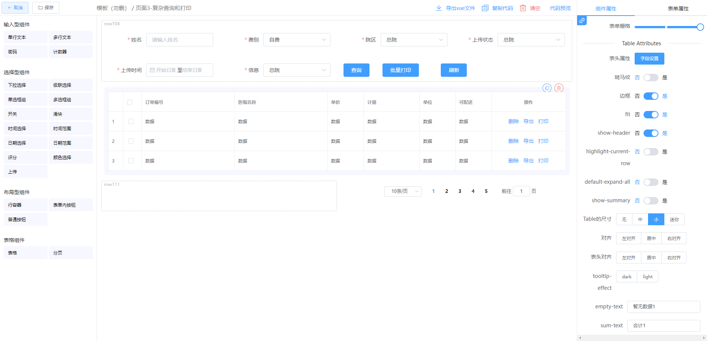
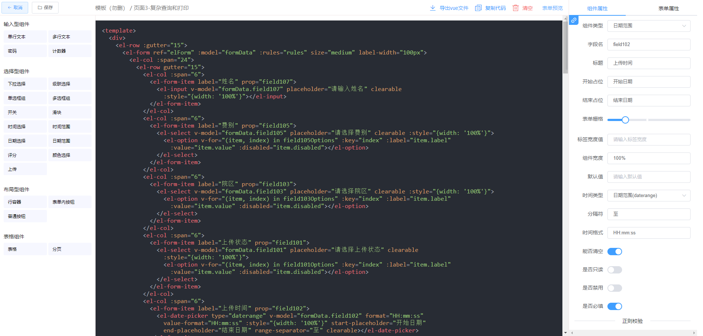

# low_code_plantform
纯前端低代码平台demo，vue框架，nodejs，pm2纯前端部署实践

(文件说明方便演示将node文件放在vue项目下了，命名为service文件夹。启动时需要同时启动vue和node如下。service-files文件夹是模拟服务器文件用来存放要保存的模板配置的文件。)

具体说明见[传送门](https://blog.csdn.net/Learn_inCSDN/article/details/136147908) https://blog.csdn.net/Learn_inCSDN/article/details/136147908
### 本地运行
根目录下启动vue：
```
$ npm run serve
```
service文件下启动node：
```
$ node server.js
```

### 打包
根目录下vue打包，将生成的 dist 文件复制到服务器`D:\winning-web\form-design`目录下
```
$ npm run build
```
service文件下node打包，将生成的 server.bundle.js 文件复制到服务器 `D:\winning-web\form-design\node`目录下
```
$ npm run build
```

### 页面demo


